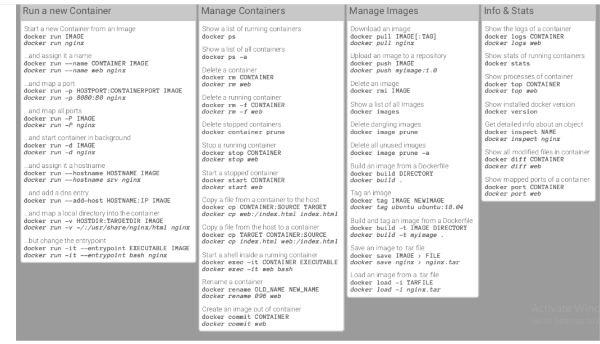
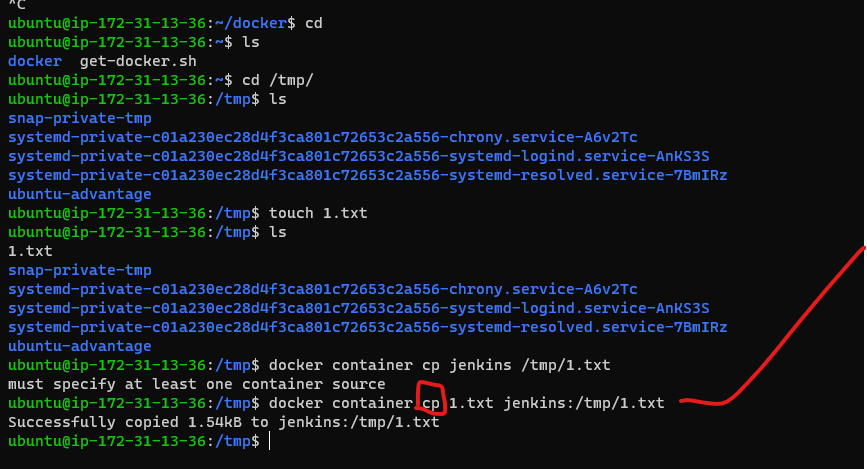
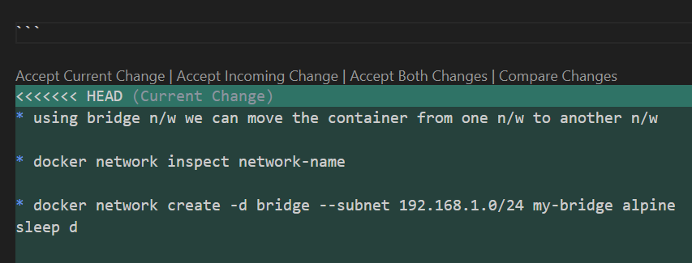

# DOCKER


### containeraization and vertualization


## docker sheet sheet 

 

[dockercommands](https://dockerlabs.collabnix.com/docker/cheatsheet/)


* Docker image and container : image nothing but package & container nothing but application . we want to build the package we required some  application .
* Container:software process created using OS virtualization  which  holds specific environment


Tower servers: designed put them on table/ground
Blade servers: arranged in racks  
DATABASE: data base not stores audios and videos it stores data of movies name , hero ,.......


We book  one ticket that ticket  number stores in database but the ticket booking pdf stores in objectstore.

Install: when ever you want to crome module systems(as user we update our whatsup)

Deploy:  take my application on some other place run on the servers (to give update on  organization )

In our ubuntu t2.micro instance we run one spring petclinic project but by using docker container  we run approximately 4 spring pet clinic projects. 
By using container we save our space & also continuous integration will be present on different ports.


Docker architecture 

Generation1: multiple services run by one network (monolithic)

Generation2: micro services (each server have different)cost is high

Generation3:docker (reducing cost )

Registry: collection of images hosted  for reuse is called registry

Dockershim: when we update the docker then also container will not stoped (it will be continuous to run)

OCI:(open container initiative)

 once the container is created the parent of the container will be dockershim.
To build docker image & container

### Docker image <command> < image>:<tag>

Docker image pull nginx : version

Ex: docker image pull busybox:3.15

To see the  all build images we use {docker image ls -q }

To see the run images only we use {docker image ls}


### Docker container <command> <container name>:<tags>

Docker container run/create nginx

RUN: to create and start the container

Hosts: it’s machines which running on docker

Entrypont: its used as a arg (it will never change)

args: arguments nothing but variable

CMD : we give any image name it change the CMD its cannot effect the entrypoint

Start: to create the container

Remove container we use 

		 { docker container rm <containername>}

Remove al containers at a time 

		{docker container rm $(docker container ls -a -q )}

### Volume:

 when we delete the container total information can be deleted so we over come this problem to create the volumes

These volumes are two types those are

        explicitly(manually): docker volume created by ours
       Automatically:these volume created by docker

Volumes are two types 
### Bind mount: 

	  its connected b/w  file system to container
	   docker host nad container have same user that tim eonly we use bind mount .

	Ex: docker container run -d --name=hemacontaier --mount "source=/tmp , target=/tmp , type=bind" ubuntu:22.04 sleep 1d

	* bind mount is connected between files/m to docker container 


### Tmpfs mount:

 * its connected  between container to memory(ram)

### Volume:


 we give only source
### Mount:

 we give both source and destination

### Hosts:

 it’s machines which running on docker 

### Entrypont
: 
its used as a arg (it will never change)
we cannot override the code

Cmd :
we can over ride the code & its acts as argument for entrypoint
 we give any image name it change the CMD its cannot effect the entrypoint (cmd used forrun the application )

### Networking: 

 (ifconfig  & sudo apt install net-tools)
 
 * we can’t install the docker in our machine we have only two network interfaces those are eth0 & lo, when ever we install docker we check the network by using  ifconfig command add another n/w is docker0.

 	Eth0: its tell about which physically connected to the s/m
	Io:
	Docker0:   this docker0 network is created only the only in 172.17.0.1 to 255.255.0.0 ip ranges only 
        Lib:  its creates the network interface inside the container only (in these eth0 have docker0 configurations)
Docker networks are three types

### Bridge:


	we use different networks (we used for multiple machines)(we communicate both ip& name in bridge network but in default bridge network we give only ip addresses)

	* manually we create some subnet ranges

	Ex: docker network ls

		docker network create --subnet 192.168.1.0/24 network-name

		docker network create --subnet 192.168.1.0/24 --gateway 192.168.1.1 my-custom-network


		docker network create --driver host  hostnetwork-name

		docker network inspect network-name

		docker network connect network-name container-name/id


### Host:

	 we have same system where we create docker installed && local machine ip addresses asssigned to the bridge container , local vm subnet ranges will be used to create contaieer ip .


* incase container connected with host network we  can connect with bridge network the container ip will be changed.


### Null:

 no network

Drawbacks of docker0 is  it’s not have DNS visible .

### BRIDGE N/W: 
 we move the containers from one network to othe network , in these
 -d  =  driver string
On bridge n/w we don’t have volumes docker container build will be failed

### Phpmyadmin: 
is used for simple log web application
Once we create container we can’t change volume(or ) mount
*docker container connects any number of containers by using host

DOCKERFILE: set of instructions

Name space:Docker uses namespaces of various kinds to provide the isolation that containers need in order to remain portable and refrain from affecting the remainder of the host system.


Alias
Alias delimage= ‘docker image rm $(docker image ls -a -q)’

Alias delcontainer= ‘docker container rm -f  $(docker container ls -a -q)’

Alias  prunevolume= ‘docker volume prune $(docker volumels -a -q)’

We replace these alias command by delimage , delcontainer & prunevolume

### Dockerfile
	dockerfile is a test file . where we write set of instructions / directives to support to create a docker image

### docker image
	docker image is read only templet or file system which has the necessary files run our application inside the docker container

### docker container vs instance
	every container has isolated area to cannot destrub them
	in instance we can't run more applications (spc , gol ,....)

### namespace:
used to create isolated areas by using isolated areas containers cannot distrub the vm

### layers 
layes reducess the inefficiency in s/w deployments
container is a collection of layers
every run and copy/add commands form one layer

### dockershim:
	allows the kubelet to interact with docker , it's used for desired state

### docker oci:
	open container initiative(ex: like hal mark to containers)

### docker swarm :
	swarm is a container archistration to maintain the container .  k8sn is a best archistration of docker ; swarm has 2 containers 
		(1) manager (assigned work to worker node)
		(2) worker 
		in swarm any one works as a master or worker

### ci/cd pipeline

codebuildby developer

this build code is push into git repository

this code will pull by devops engineer

by using jenkins / azuredevops we build the code(build image)

test this image (automatic test is unit test)

image will scaned(by default software tool is snyk)

the image will be stored in docker hub ,or ECR or ACR 

for maintained desired state of container (we write docker or k8s yaml files)

using k8s to maintaine desired state and end user  can utilize our application continuously
(no down time )


### name spaces
### micro- services design problem
### expose the application running inside docker to external world

### Running Docker Containers

#### Interactions

	* We can interact with running or stopped containers

	* attach: We will be able to connect to containers main process’s STDIN/STDOUT/STDERR.

	* cp: This allows to send or recieve content to/from container

	* exec: Execute a command inside containers’s isolation.

	* logs: Here we can review all the STDERR and STDOUT

* run jenkins container in detached mode


* 		docker container logs de50fd695277/jenkins

*		docker container logs <container id>(or)<container name>

#### Copy files from docker host into contianer




### Limiting Host resources

*  Lets review some options for container resource consumption. We will be able to limit access to CPU,memory and block devices

*	hard limits: Thse represent container will not get more than declared value

* Container by default can consume all of host resources (no limits)


Options:

–cpu-period and –cpu-quota: This is specified in micro seconds and will modify cpu limits

–cpu-shares: This manages weight for containers main process. This is soft limit.

–cpus

–memory: maximum amount of memory for your container (hard limit)

–memory-reservation: this is soft limit

–blkio-weight

–blkio-weight-device 
* 

####  game of life application

* write pipeline for gol in azure -devops 

* and download gameoflife.war
* sftp 
* put gameoflife.war
* bye
* create docker container and copy the docker upload files
    
	docker container cp gameoflife.war <container-id>:/tmp/gameoflife.war

	docker container exec <container-id> /bin/bash

### NETWORKING

* three types of networkings are present in docker for single node containrs  those are

#### [1] null network

*  no network available in the containers

#### [2] host networks 

* host {instance} ip giving to the  container 

#### [3] bridge network

* in single instance more than one container then any 2 containers communicate by using bridge network . 
* by using any subnet id we can create these network
```
docker network ls

docker network create bridge --subnet <"any-subnet-id"> <name-of-the-network>

### container attached to the network

docker container run -d --name <name-ofthe-container> --network <network-name> httpd

docker exec <container-name> ping -c <any-number> 

### incase oci not support to the ping command inside container execute these commands

apt-get update
apt-get install iputils-ping -y


```

* using bridge n/w we can move the container from one n/w to another n/w

* docker network inspect network-name

* docker network create -d bridge --subnet 192.168.1.0/24 my-bridge alpine sleep d 

* docker container exec c2 ping -c 4 c3
		 
		 here c2 , c3 = containers 
		      c = howmany times we ping the container

* defalut bridge network containers communicate with ips only


### docker swarm 

* two containrs communicate with each other with 2 different vm 's at that time we use overlay network 


```yaml
version: '3.8'

services:
  gameoflife:
    image: gameoflife-image:latest
    container_name: gameoflife
    networks:
      - my-bridge-network
    depends_on:
      - mysql

  mysql:
    image: mysql:latest
    container_name: mysql
    environment:
      MYSQL_ROOT_PASSWORD: rootpassword
      MYSQL_DATABASE: gameoflife_db
      MYSQL_USER: user
      MYSQL_PASSWORD: userpassword
    volumes:
      - mysql-data:/var/lib/mysql
    networks:
      - my-bridge-network

networks:
  my-bridge-network:
    driver: bridge

volumes:
  mysql-data:

```
* docker compose up

* docker compose down

* docker image build -d image-name docker-file-path

* docker image pull image-name

* docker container run -d -P image-name

* docker contaier run -it -d image-name

* docker container exec -it container-id /bin/sh

* docker container stop container-id

* docker container kill/rm/prune <container-id>

* docker container rn -f $(docker container ls -a -q)

* docker container run -d -p 3000:80 httpd

	docker container exec -it httpd /bin/sh

	mkdir -p /ram/rahim/rabert

	cd /ram/rahim/rabert

	touch 1.txt

	echo "hai hemachaitanya dear" > 1.txt

* docker commit httpd-id username/imagename (this is use to create new changes include image from container)

* docker container logs container-id

* docker stats containr-id

* docker ps

* docker container run -d -P image-id/name --cpu=2Gi --memory=0.5Gb

* docker image save -o <hema.tar> image1 image2 image3

* get /home/ubuntu/hema.tar ~/.

* docker image load -i <hema.tar>

* docker attach <container-id>

* docker container cp 1.txt <container-name>:/tmp/

## git merge conflicts 

* how to accept gi-merge-conflicts 




